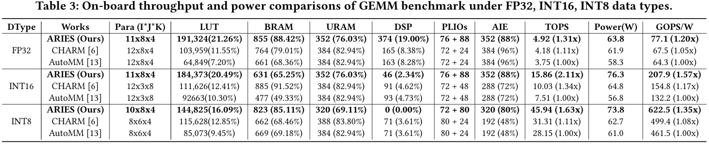
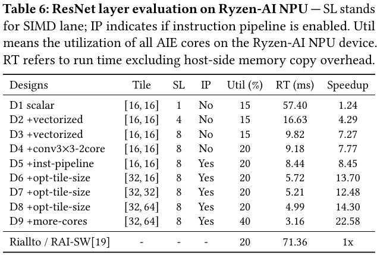

# FPGA'25 Submission #49 ARIES
[](https://doi.org/10.5281/zenodo.14492668)

## Installation Guide

### Prerequisites
```
cmake 3.29.1 
clang
lld
python 3.8.x
ninja
AMD Vitis 2023.1
```
### 0. Install prerequisites on Ubuntu 20.04 (Since "sudo" is required, it is highly recommended to use a clean and isolated environment)
```sh
sudo apt-get update
sudo apt-get upgrade
sudo apt-get install gcc-multilib
sudo apt install graphviz
```
#### Install clang, lld, ninja and CMAKE 3.29.1
```sh
sudo apt install clang lld ninja-build
sudo apt-get install libssl-dev libidn11
wget https://cmake.org/files/v3.29/cmake-3.29.1.tar.gz
tar -xzvf cmake-3.29.1.tar.gz
cd cmake-3.29.1
./bootstrap
make -j$(nproc)
sudo make install
```

#### Install Python3.8
```sh
sudo apt install python3.8-dev
sudo apt install python3.8-venv
```

### 1. Download Aries & Submodules
```sh
$ git clone --recursive https://github.com/JinmingZhuang/FPGA25_ARIES_AE.git
$ cd FPGA25_ARIES_AE
```

### 2. Setup Python Virtual Environment
```sh
source utils/setup_python_packages.sh
source sandbox/bin/activate
```

### 3. Build LLVM & MLIR Projects
```sh
source utils/build-llvm.sh
```

### 4. Build MLIR-AIE Project 
#### AIE License is required: 
#### (1) please view the processes here: https://riallto.ai/prerequisites-aie-license.html <br> (2) Additionally, hostname can be found by running:<br>
```
hostname
```
#### (3) After "Xilinx.lic" is generated, save it to the correct PATH (~/.Xilinx).


#### Need to specify using local cmake instead of Vitis cmake inside "utils/build-mlir-aie.sh" (In this script, it is set to the default PATH which should work if following the CMAKE installation before)
```sh
source /tools/Xilinx/Vitis/2023.1/settings64.sh
source utils/build-mlir-aie.sh
```

### 5. Build Aries Project
```sh
source utils/build-aries.sh
export PATH=$PATH:$PWD/build/bin
```

##  Artifact Evaluation Description
### 1. GEMM (FP32, INT16, INT8)
#### The designs that reproduce the results in Table 3 can be found in example/example_gemm. Please refer to the corresponding README file for compilation instructions.


### 2. Tensor operations (MTTKRP, TTMC, TTM)
#### The designs that reproduce the results in Table 4 can be found in example/example_${benchmarks}. Please refer to the corresponding README file for compilation instructions.


### 3. ResNet Layers
#### The designs that reproduce the results in Table 5 can be found in example/resnet_conv2x_layer. Please refer to the corresponding README file for compilation instructions.
