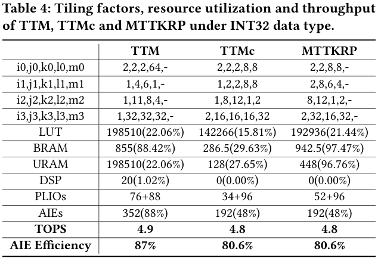

# FPGA'25 Submission #49 ARIES
[](https://doi.org/10.5281/zenodo.14492668)

## Installation Guide

### Prerequisites
```
cmake 3.29.1 
clang
lld
python 3.8.x
ninja
AMD Vitis 2023.1
```

### 1. Download Aries & Submodules
```sh
$ git clone --recursive https://github.com/JinmingZhuang/FPGA25_ARIES_AE.git
$ cd FPGA25_ARIES_AE
```

### 2. Setup Python Virtual Environment
```sh
source utils/setup_python_packages.sh
source sandbox/bin/activate
```

### 3. Build LLVM & MLIR Projects
```sh
source utils/build-llvm.sh
```

### 4. Build MLIR-AIE Project 
#### Need to specify using local cmake instead of Vitis cmake inside "utils/build-mlir-aie.sh"
```sh
source /tools/Xilinx/Vitis/2023.1/settings64.sh
source utils/build-mlir-aie.sh
```

### 5. Build Aries Project
```sh
source utils/build-aries.sh
export PATH=$PATH:$PWD/build/bin
```

##  Artifact Evaluation Description
### 1. GEMM (FP32, INT16, INT8)
#### The designs that reproduce the result in Table 3 can be found in example/example_gemm. Please refer to the corresponding README file for compilation instructions.


### 2. Tensor operations (MTTKRP, TTMC, TTM)
#### The designs that reproduce the result in Table 4 can be found in example/example_${benchmarks}. Please refer to the corresponding README file for compilation instructions.


### 3. ResNet Layers
#### The designs that reproduce the result in Table 5 can be found in example/resnet_conv2x_layer. Please refer to the corresponding README file for compilation instructions.


